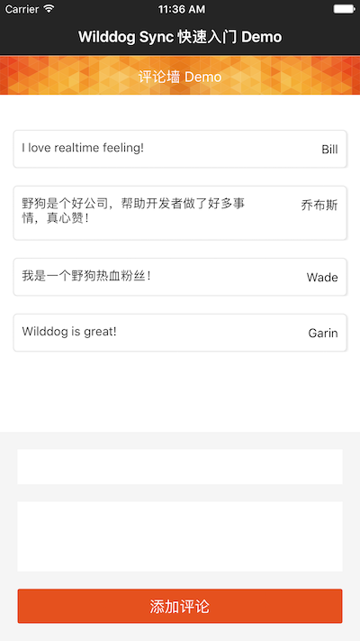
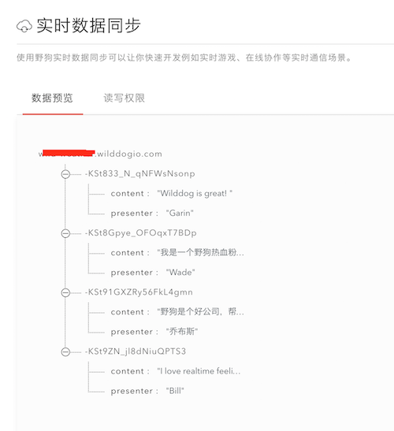

# Wilddog Sync 快速入门 Demo 

此 Demo 实现了一个常见的评论墙的功能。效果如下：

### 克隆代码

    git clone https://github.com/WildDogTeam/sync-quickstart-ios.git
    cd sync-quickstart-ios
    pod install

### 替换成你的应用

此 Demo 使用的是野狗提供的示例应用，你可以在 AppDelegate.m 文件中将 wilddogUrl 字符串中的示例应用替换成自己的应用。

替换成你自己的应用之后，可以在 [`控制面板-数据预览`](https://docs.wilddog.com/console/administer.html#数据预览) 中实时看到数据变化：

### 更多示例

这里分类汇总了 WildDog平台上的示例程序和开源应用，链接地址：[https://github.com/WildDogTeam/wilddog-demos](https://github.com/WildDogTeam/wilddog-demos)

### 相关文档

* [Wilddog 概览](https://z.wilddog.com/overview/introduction)
* [IOS SDK快速入门](https://z.wilddog.com/ios/quickstart)
* [IOS SDK API](https://z.wilddog.com/ios/api)
* [下载页面](https://www.wilddog.com/download/)
* [Wilddog FAQ](https://z.wilddog.com/questions)

### License
MIT
http://wilddog.mit-license.org/
